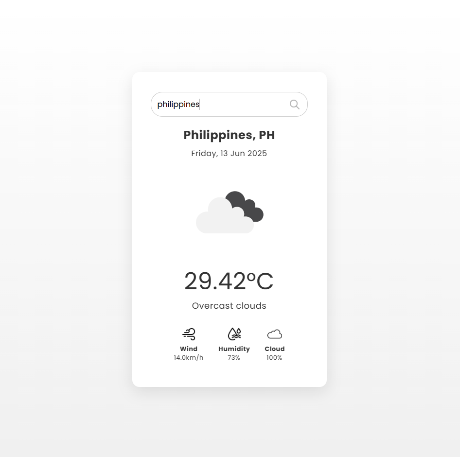

# 🌤️ WeatherApp

**WeatherApp** is a responsive weather application that allows users to search for real-time weather information by city. Built with HTML, CSS, and JavaScript, it integrates with the OpenWeatherMap API to fetch live weather data such as temperature, wind speed, humidity, and cloudiness.

Live Demo: [https://bogiiiie.github.io/WeatherApp/](https://bogiiiie.github.io/WeatherApp/) ✅

---

## 📸 Preview

> Designed and built by **Stephen William G. De Jesus**  



---

## 🚀 Features

- 🌍 Search weather data for any city
- 🌡️ Real-time:
  - Temperature
  - Weather condition and icon
  - Wind speed (km/h)
  - Humidity
  - Cloud percentage
  - Date display
- 🔎 Smooth and user-friendly input field with custom styling
- 💻 Fully responsive layout for all devices

---

## 🛠️ Technologies Used

- HTML5
- CSS3
- JavaScript (ES6)
- OpenWeatherMap API
- Google Fonts (Poppins)

---

## 🧩 Setup Instructions

1. **Clone this repository**:
   ```bash
   git clone https://github.com/bogiiiie/WeatherApp.git
   cd WeatherApp
